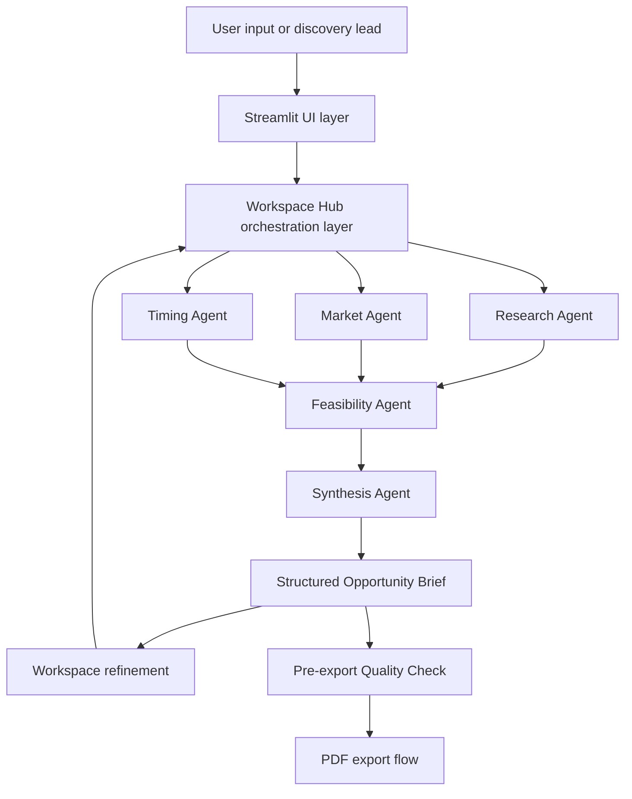

# Architecture Overview

This document provides a high-level public overview of the AI Research Commercialisation Workbench architecture. It is intentionally simplified for portfolio review and does not include private prompts, implementation logic, deployment configuration, or source code.

## High-level Architecture

## Main Components

### Streamlit UI Layer

The UI layer provides the main product experience: project input, opportunity discovery entry, analysis workspace, structured brief display, follow-up interaction, review controls, and export access.

### Workspace Hub Orchestration Layer

The Workspace Hub coordinates follow-up interactions inside the analysis workspace. It helps route user questions, manage shared project context, preserve useful conversation history, and support actions such as Retry, Ignore, and Apply to Brief.

### Specialist Agents

The product uses specialist agents to break down the opportunity assessment into focused dimensions:

- **Research Agent:** project understanding and technical framing
- **Market Agent:** application potential, customer problems, and market logic
- **Timing Agent:** external evidence signals and timing considerations
- **Feasibility Agent:** commercialisation pathway, validation needs, and practical constraints

### Synthesis Agent

The Synthesis Agent consolidates specialist outputs into a structured Opportunity Brief. Its role is to turn separate analyses into a coherent decision-support artifact with clearer sectioning, evidence awareness, caveats, risks, and recommended next steps.

### Opportunity Brief Artifact

The Opportunity Brief is the central structured output. It allows users to review the opportunity across commercialisation dimensions and refine the brief through follow-up interactions.

### Quality Review Layer

The Pre-export Quality Check acts as a lightweight decision-readiness review before export. It highlights evidence gaps, weak claims, unresolved validation needs, and overconfident scoring risk so users can understand what is evidence-based, inferred, or still requiring validation.

### 2.0 Productization Roadmap

The broader 2.0 upgrade extends the prototype across four productization tracks: AI output quality governance, evaluation automation, model/cost governance, and context/memory safety. In the current iteration, the active delivery focus is the AI quality layer: making output risks visible, measurable, and easier to review before they affect user decisions.

The quality-layer work turns recurring AI failure modes, such as unsupported claims, overconfident conclusions, context loss, and overly broad brief updates, into fixed evaluation scenarios. These scenarios can then support automated regression-style checks whenever prompts, agent behaviour, model routing, or brief update logic changes.

This layer treats quality, cost, and context consistency as shared product metrics. Model calls are intended to be governed by task purpose and risk level, while human review remains the checkpoint for high-risk decisions and externally shared outputs.

### PDF Export Flow

After review and refinement, users can export the Opportunity Brief as a shareable PDF.

## Design Principles

- Keep AI outputs structured enough to review and update.
- Let users refine the brief through controlled workspace actions rather than one-off chat.
- Preserve transparency around agent source, ignored context, and applied updates.
- Treat early-stage commercialisation analysis as evidence-aware decision support, not as a final certainty claim.
- Keep public documentation focused on product and architecture outcomes while keeping private implementation details protected.
