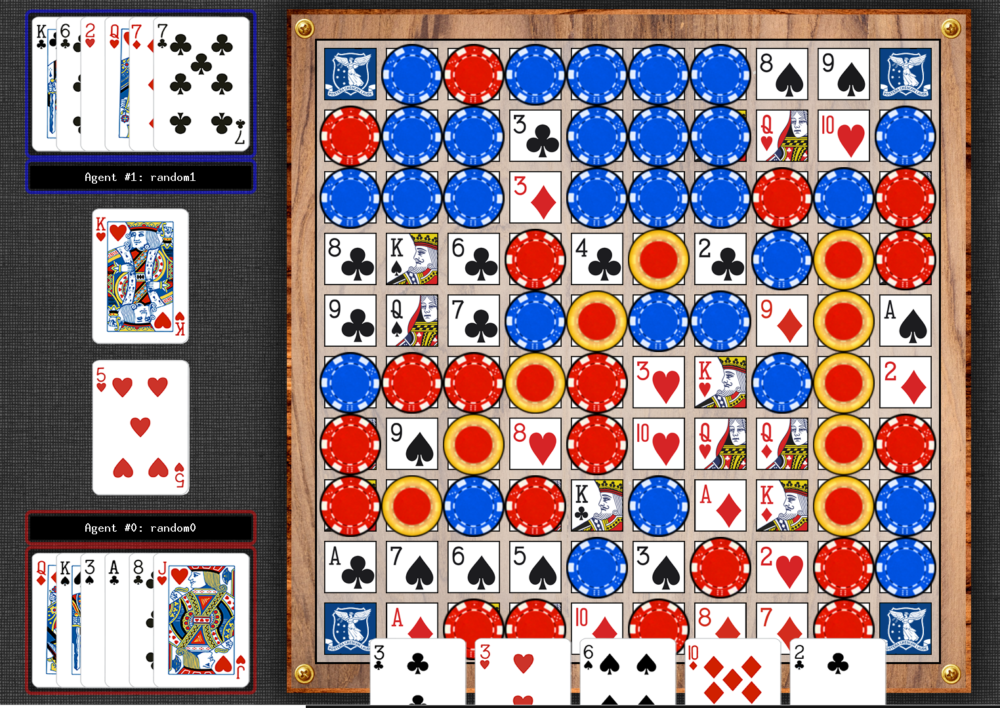

# Sequence Project Template

 
    
 

 
The purpose of this project is to implement an autonomous agent that can play the game Sequence and compete in the UoM COMP90054-2025 Sequence competition:

 **Please read carefully the rules of the [Sequence game](https://en.wikipedia.org/wiki/Sequence_(game))**. Sequence can be understood as a non-deterministic 2-player game. Understanding the results and different strategies is important for designing a good agent for this project. Additional technical information on the contest project and how to get started can be found in file [sequence.md](Sequence/sequence.md). 

## Task Introduction
 
**Your task** is to develop an autonomous Sequence agent to play the **Sequence Contest** by suitably modifying file [`agents/t_XXX/myTeam.py`](agents/t_052/myTeam.py). Please replace "XXX" in "t_XXX" with your own Canvas Teams ID. For example, if your team's Canvas Teams Name is "Canvas Teams 1", then you should change your folder from `agents/t_XXX/` to `agents/t_001/`. The code submitted should aim to be commented at high standards, be error-free, and _never crash_. 

---

In your solution, you have to use at **least 3 AI-related techniques**. that have been discussed in the subject or explored by you independently, and you can combine them in any form. **We won't accept a final submission with less than 3 techniques**. Some candidate techniques that you may consider are:

1. Blind or Heuristic Search Algorithms (using general or Sequence specific heuristic functions).
2. Classical Planning (PDDL and calling a classical planner).
3. Policy iteration or Value Iteration (Model-Based MDP).
4. Monte Carlo Tree Search or UCT (Model-Free MDP).
5. Reinforcement Learning – classical, approximate or deep Q-learning (Model-Free MDP).
6. Goal Recognition techniques (to infer intentions of opponents).
7. Game Theoretic Methods.

We recommend you to start by using search algorithms, given that you already implemented their code in the first project. You can always use hand coded decision trees to express behaviour specific to Sequence, but they won't count as a required technique. You are allowed to express domain knowledge, but remember that we are interested in "autonomy", and hence using techniques that generalise well. The 7 techniques mentioned above can cope with different games much easier than any decision tree (if-else rules). If you decide to compute a policy, you can save it into a file and load it at the beginning of the game, as you have 15 seconds before every game to perform any pre-computation. 

> [!NOTE]
> Not all of the techniques you have experimented with must be used in the final agent. Your group submission may: 
> 1. Be a combination of 3 different techniques.
> 2. Be a combination of 2 different techniques, and have the 3rd technique as runnable agent separately stored (as a Python file in your repository's agents/t_XXX directory).
> 3. Be 1 technique only, but have 2 other techniques as runnable agents separately stored (as 2 Python files in your repository's agents/t_XXX directory). 

> [!TIP] 
> Remember to also read the [sequence.md](Sequence/sequence.md) file containing technical information that will come in handy.

# Agent Guideline #
 - **For having a look at my agent, please refer to `agents-t_052-myAgent.py`.**
 - For comprehensive technical documentation and insights, please see `wiki-template-Home.md` for more information.
 - For Sequence game introduction and board status, please refer to `Sequence` for more information.

**HAPPY SEQUENCE!**

